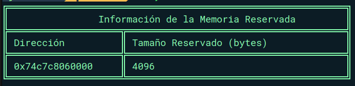
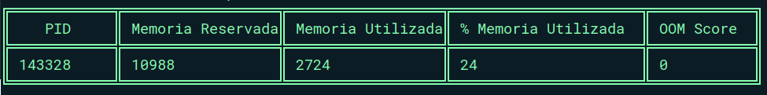
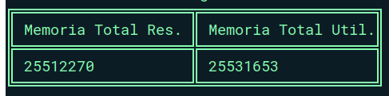
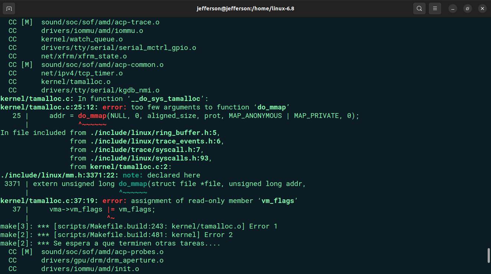
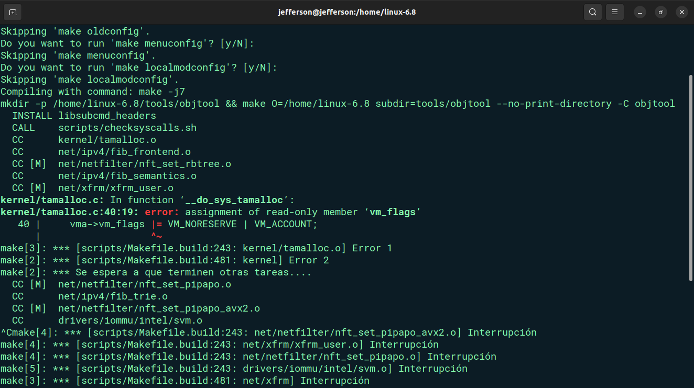
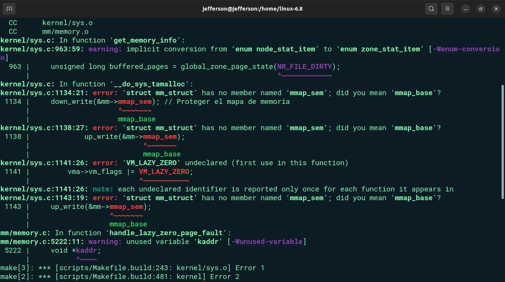
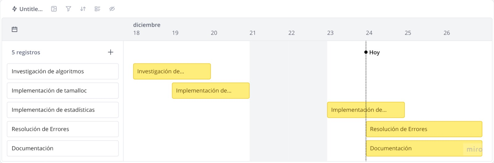

# **Proyecto 2**

<div>🏛 Universidad San Carlos de Guatemala</div>
<div>📕 Sistemas Operativos 2</div>
<div>📆 Diciembre 2024</div>
<div>🙍‍♂️ Brandon Andy Jefferson Tejaxún Pichiyá</div>
<div>🆔 202112030</div>

<br>
<br>


## **Introducción ✅**

El desarrollo de tamalloc introduce una nueva variante en los asignadores de memoria, diseñada para garantizar la inicialización progresiva de las páginas de memoria en cero únicamente cuando son accedidas. Este enfoque evita marcar toda la memoria reservada como utilizada de inmediato, permitiendo un control más eficiente del tamaño RSS y optimizando el manejo del over-commit en el sistema operativo.

## **Objetivo 🎯**

Desarrollar un asignador de memoria capaz de inicializar la memoria en cero u otro carácter predeterminado, evitando la reserva inmediata de páginas físicas y optimizando el uso de recursos del sistema.

### **Tamalloc**

tamalloc utiliza el enfoque de lazy-zeroing para inicializar páginas de memoria en cero de forma diferida. Primero, valida el tamaño solicitado y reserva el espacio virtual necesario sin asignar páginas físicas de inmediato, utilizando banderas como MAP_NORESERVE. Las páginas son inicializadas únicamente al primer acceso, cuando un page fault activa su asignación y escritura en cero, optimizando el uso de recursos del sistema.

```c

```

```c
static inline int validate_size(size_t size) {
    if (size == 0 || size > TASK_SIZE) {
        return -EINVAL;
    }
    return 0;
}

static inline unsigned long reserve_memory(size_t size) {
    unsigned long populate = 0;
    vm_flags_t vm_flags = 0;
    unsigned long pgoff = 0;
    struct list_head *uf = NULL;

    return do_mmap(NULL, 0, size, PROT_READ | PROT_WRITE, MAP_PRIVATE | MAP_ANONYMOUS | MAP_NORESERVE, vm_flags, pgoff, &populate, uf);
}

SYSCALL_DEFINE1(jeff_tamalloc, size_t, size) {
    int validation_result;
    unsigned long addr;

    validation_result = validate_size(size);
    if (validation_result < 0) {
        return validation_result;
    }

    addr = reserve_memory(size);
    if (IS_ERR_VALUE(addr)) {
        return addr;
    }

    return addr;
}
```

### **Memoria en procesos**

La syscall recoge estadísticas de uso de memoria para un proceso específico, identificando la memoria reservada (en KB), la memoria comprometida (en KB y porcentaje respecto a la memoria reservada), y el puntaje OOM (Out of Memory). Al recibir un PID, se obtiene el proceso correspondiente y se calcula la memoria reservada y comprometida. Las estadísticas se devuelven al espacio de usuario en una estructura que incluye el PID, la memoria reservada, la memoria comprometida, su porcentaje y el OOM score.

```c
struct process_memory_stats {
    pid_t pid;
    unsigned long reserved_kb;
    unsigned long committed_kb;
    unsigned long committed_pct;
    int oom_score;
};

SYSCALL_DEFINE2(jeff_process_memory, pid_t, pid, struct process_memory_stats __user *, stats) {
    struct task_struct *task;
    struct process_memory_stats local_stats;
    unsigned long reserved_kb = 0;
    unsigned long committed_kb = 0;

    rcu_read_lock();
    task = pid_task(find_vpid(pid), PIDTYPE_PID);
    if (!task) {
        rcu_read_unlock();
        return -ESRCH;
    }

    reserved_kb = (task->mm->total_vm << (PAGE_SHIFT - 10));
    committed_kb = (task->mm->hiwater_vm << (PAGE_SHIFT - 10));

    local_stats.pid = pid;
    local_stats.reserved_kb = reserved_kb;
    local_stats.committed_kb = committed_kb;
    local_stats.committed_pct = reserved_kb ? (committed_kb * 100 / reserved_kb) : 0;
    local_stats.oom_score = task->signal->oom_score_adj;

    rcu_read_unlock();

    if (copy_to_user(stats, &local_stats, sizeof(local_stats))) {
        return -EFAULT;
    }

    return 0;
}
```

### **Memoria Total**

La syscall recopila estadísticas globales de uso de memoria de todos los procesos en el sistema, sumando la memoria total reservada y comprometida en MB. Se recorren todos los procesos activos, acumulando la memoria reservada y comprometida de cada uno, y se devuelve un resumen total al espacio de usuario, mostrando la memoria reservada y comprometida en MB.

```c
struct total_memory_stats {
    unsigned long total_reserved_mb;
    unsigned long total_committed_mb;
};

SYSCALL_DEFINE1(jeff_total_memory, struct total_memory_stats __user *, stats) {
    struct task_struct *task;
    struct total_memory_stats local_stats = {0};
    unsigned long total_reserved_kb = 0;
    unsigned long total_committed_kb = 0;

    rcu_read_lock();
    for_each_process(task) {
        if (!task->mm)
            continue;

        total_reserved_kb += (task->mm->total_vm << (PAGE_SHIFT - 10));
        total_committed_kb += (task->mm->hiwater_vm << (PAGE_SHIFT - 10));
    }
    rcu_read_unlock();

    local_stats.total_reserved_mb = total_reserved_kb / 1024;
    local_stats.total_committed_mb = total_committed_kb / 1024;

    if (copy_to_user(stats, &local_stats, sizeof(local_stats))) {
        return -EFAULT;
    }

    return 0;
}
```

## **Test de Syscalls**

### **Syscall 1**

```c
#include <stdio.h>
#include <unistd.h>
#include <sys/syscall.h>
#include <errno.h>

#define JEFF_TAMALLOC_SYSCALL 551

void print_table_header() {
    printf("╔════════════════════════════════════════════════════════════╗\n");
    printf("║                Información de la Memoria Reservada         ║\n");
    printf("╠════════════════════╦═══════════════════════════════════════╣\n");
    printf("║ Dirección          ║ Tamaño Reservado (bytes)              ║\n");
    printf("╠════════════════════╬═══════════════════════════════════════╣\n");
}

void print_table_row(void *addr, size_t size) {
    printf("║ %-18p ║ %-37zu ║\n", addr, size);
}

void print_table_footer() {
    printf("╚════════════════════╩═══════════════════════════════════════╝\n");
}

int main() {
    size_t size = 4096;
    void *addr;

    addr = (void *)syscall(JEFF_TAMALLOC_SYSCALL, size);

    if ((long)addr < 0) {
        perror("Error al llamar a jeff_tamalloc");
        return 1;
    }

    print_table_header();
    print_table_row(addr, size);
    print_table_footer();

    return 0;
}
```



### **Syscall 2**

```c
#include <stdio.h>
#include <stdlib.h>
#include <unistd.h>
#include <sys/syscall.h>
#include <errno.h>
#include <signal.h>

#define SYSCALL_JEFF_PROCESS_MEMORY 552

struct process_memory_stats {
    pid_t pid;
    unsigned long reserved_kb;
    unsigned long committed_kb;
    unsigned long committed_pct;
    int oom_score;
};

void print_process_table_header() {
    printf("╔════════════╦══════════════════╦══════════════════╦══════════════════════╦════════════╗\n");
    printf("║    PID     ║ Memoria Reservada║ Memoria Utilizada║ % Memoria Utilizada  ║ OOM Score  ║\n");
    printf("╠════════════╬══════════════════╬══════════════════╬══════════════════════╬════════════╣\n");
}

void print_process_table_row(struct process_memory_stats stats) {
    printf("║ %-10d ║ %-16lu ║ %-16lu ║ %-20lu ║ %-10d ║\n",
           stats.pid, stats.reserved_kb, stats.committed_kb, stats.committed_pct, stats.oom_score);
}

void print_process_table_footer() {
    printf("╚════════════╩══════════════════╩══════════════════╩══════════════════════╩════════════╝\n");
}

int process_exists(pid_t pid) {
    char path[64];
    snprintf(path, sizeof(path), "/proc/%d", pid);
    return access(path, F_OK) == 0;
}

void test_process_stats(pid_t pid) {
    struct process_memory_stats stats;

    if (!process_exists(pid)) {
        fprintf(stderr, "Error: El proceso con PID %d no existe o no es accesible.\n", pid);
        return;
    }

    if (syscall(SYSCALL_JEFF_PROCESS_MEMORY, pid, &stats) == 0) {
        print_process_table_header();
        print_process_table_row(stats);
        print_process_table_footer();
    } else {
        perror("Error al obtener estadísticas del proceso");
    }
}

int main(int argc, char *argv[]) {
    if (argc != 2) {
        fprintf(stderr, "Uso: %s <PID>\n", argv[0]);
        return 1;
    }

    pid_t pid = atoi(argv[1]);

    if (pid <= 0) {
        fprintf(stderr, "Error: PID no válido. Debe ser un número positivo.\n");
        return 1;
    }

    if (geteuid() != 0) {
        fprintf(stderr, "Error: Este programa debe ejecutarse como superusuario.\n");
        return 1;
    }

    printf("Probando estadísticas del proceso con PID: %d\n", pid);
    test_process_stats(pid);

    return 0;
}
```



### **Syscall 3**

```c
#include <stdio.h>
#include <unistd.h>
#include <sys/syscall.h>
#include <errno.h>

#define SYSCALL_JEFF_TOTAL_MEMORY 553

struct total_memory_stats {
    unsigned long total_reserved_mb;
    unsigned long total_committed_mb;
};

void print_total_table(struct total_memory_stats stats) {
    printf("╔════════════════════╦════════════════════╗\n");
    printf("║ Memoria Total Res. ║ Memoria Total Util.║\n");
    printf("╠════════════════════╬════════════════════╣\n");
    printf("║ %-18lu ║ %-18lu ║\n", stats.total_reserved_mb, stats.total_committed_mb);
    printf("╚════════════════════╩════════════════════╝\n");
}

void test_total_stats() {
    struct total_memory_stats stats;

    if (syscall(SYSCALL_JEFF_TOTAL_MEMORY, &stats) == 0) {
        print_total_table(stats);
    } else {
        perror("Error al obtener estadísticas globales");
    }
}

int main() {
    printf("Probando estadísticas globales del sistema:\n");
    test_total_stats();

    return 0;
}
```



## Errores/Problemas

* Error con los parámetros de *mmap*
* Asignación de vm_flags
* Error con reconomiento de Syscall (volví a compilar todo :'v)





## **Cronograma**



## **Reflexión**

El proyecto ha sido una experiencia invaluable en términos de aprendizaje y desarrollo de habilidades a nivel del kernel de Linux. Al trabajar con el kernel, he profundizado en varios aspectos fundamentales del sistema operativo, como la gestión de memoria, las llamadas al sistema y la interacción directa con el hardware.

A lo largo del proyecto y en muchos otros aspectos de la vida, he aprendido que el progreso no siempre es inmediato ni visible, pero está en cada paso que damos, incluso en los más pequeños. Enfrentar retos complejos, como desarrollar un sistema operativo o aprender de nuevas tecnologías, puede parecer una tarea frustrante. Sin embargo, es en esos momentos de dificultad donde realmente se forja el crecimiento personal y profesional.

* Aprender a planificar y gestionar el tiempo realizando actividades que incluyan cada una de las funcionalidades requeridas.
* Resolución de problemas de distintas complejidades para llegar a un resultado satisfactorio.

